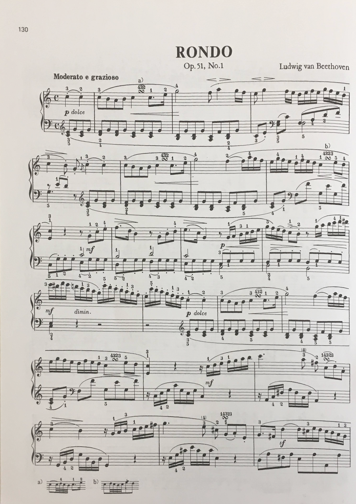

# Free music transposition from a picture!

<!-- 
code from https://www.codingforums.com/php/162542-how-do-i-let-users-upload-pictures.html)
-->
<form enctype="multipart/form-data" action="uploader.php" method="POST">
<input type="hidden" name="MAX_FILE_SIZE" value="100000" />
Upload your music here: <input name="uploadedfile" type="file" /> 
<input type="submit" value="Upload File" />
</form>

<!-- 
code from https://www.codingforums.com/php/162542-how-do-i-let-users-upload-pictures.html)
-->
<form enctype="multipart/form-data" action="uploader.php" method="POST">
<input type="hidden" name="MAX_FILE_SIZE" value="100000" />
Upload your music here: <input name="uploadedfile" type="file" /> 
<input type="submit" value="Upload File" />
</form>

### Your current music:
<!--
code from https://www.w3schools.com/tags/tag_input.asp
-->

<form action="/action_page.php">
  starting key: <input type="text" name="endkey"> 
  starting octave number: <input type="text" name="endoctave"> 
  <input type="submit" value="Submit">
</form>

### The music you want:

<form action="/action_page.php">
  goal key: <input type="text" name="endkey"> 
  goal octave number: <input type="text" name="endoctave"> 
  <input type="submit" value="Submit">
</form>

# Confused?

here is an example. Say I want to transpose this page of sheet music:

 
 
First, I would take a picture of it, and save that picture as a 
.png file. (The picture I show above is a .png)

Then, I would upload the png file to this page, where it says "upload your picture here"
INSERT PIC OF HOW TO UPLOAD

As you can see, 
this picture is in the key of INSERT KEY HERE 
in the INSERT OCTAVE HERE octave. 
(Click the following links for information on how to figure out what 
[key](https://www.themusicalear.com/how-to-identify-key-signatures/) 
or 
[octave](http://slideplayer.com/2815825/10/images/16/Note+Names+and+Frequencies.jpg)
 your piece is in.)

So, I would type KEY 